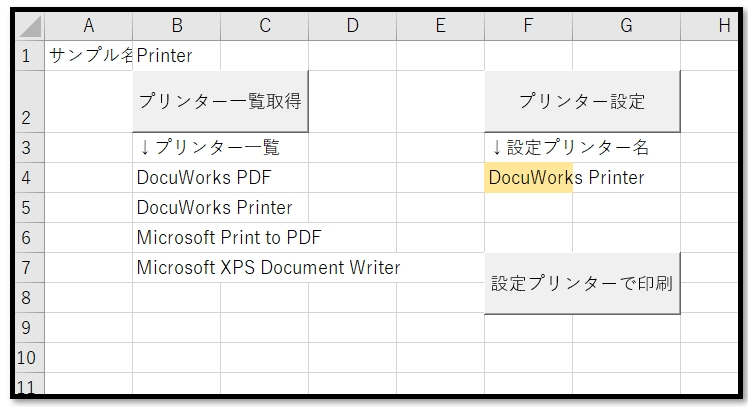
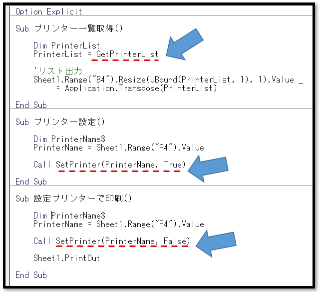

# VBA-Printer
- License: The MIT license

- Copyright (c) 2021 YujiFukami

- 開発テスト環境 Excel: Microsoft® Excel® 2019 32bit 

- 開発テスト環境 OS: Windows 10 Pro

実行環境など報告していただくと感謝感激雨霰。

# 説明
プリンター一覧取得、プリンターの設定

## 活用例
プリンター設定の自動化

起動時に毎回既定のプリンターになってしまう印刷設定のところを、印刷機を強制的に指定して印刷させる。

# 使い方
実行サンプル「Sample-Printer.xlsm」の中の使い方は以下の通り。

サンプル中身

順番に「プリンター一覧取得」「プリンター設定」「設定プリンターで印刷」のボタンがある

「プリンター一覧取得」にてセル[B4]以下に設定可能な全プリンター名を出力する。

「プリンター設定」でセル[F4]に入力してあるプリンター名で印刷対象のプリンターを設定。

「設定プリンターで印刷」で「F4」に入力してあるプリンター名で、本シートをプリントする。

プロシージャ中身

プロシージャ「GetPrinterList」と「SetPrinter」が使われている。

「GetPrinterList」は設定可能な全プリンター名一覧を一次元配列で取得する。引数なし。

「SetPrinter」は指定プリンター名でプリンターを設定する。

引数は

-  PrinterName         ・・・プリンター名（String型）
-  [MessageIrunaraTrue]・・・確認メッセージがいるかどうか。デフォルトはTrue

## 設定
実行サンプル「Sample-Printer.xlsm」の中の設定は以下の通り。

### 設定1（使用モジュール）

-  ModTest.bas
-  ModPrinter.bas

### 設定2（参照ライブラリ）
なし

